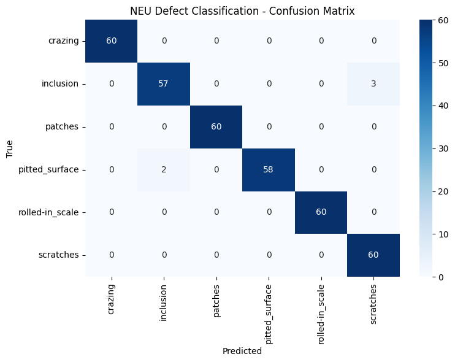

# NEU Steel Defect Classification
Classifies 6 different defects seen in steel.
Dataset: NEU steel surface defects, 6 classes, 1,800 images
From Kaggle/datasets/kaustubhdikshit/neu-surface-defect-database
Approach: transfer learning was implemented using the ResNet18 model. The backbone was frozen and a new 6-class head was attached to it. The pretrained backbone was kept frozen because its early layers already detect general visual features (edges, textures) useful across image tasks; only the new head was trained.The seeds were made reproduceable for torch (CPU & cuda), NumPy, etc.. so, the results will stay the same. 
The head of the model was trained for 5 epochs, and there was a validation after each training epoch.  Finally, the model was tested on the test data and the results were interpreted using classification report and a confusion matrix.
The split: The original dataset contained 2 folders for training and validation. The train data was randomly split for training and validation. And the original validation data was used as test data. This is cleaner because the test set was never seen during training or tuning, so there's no leakage from the split. (I did not check for duplicate images across the original folders.)
During training: The model’s validation loss and training loss was seen to decrease but the validation accuracy was seen oscillating in the same range. In the reproducible result, it is constant at 0.9896 for the last 3 epochs.
Results: The model produced a reproducible 99% (seed 42) output and when the model was unseeded, it produced test accuracy in the 96 – 99% range. 
In the reproducible run, two confusions appeared: 3 inclusion images misclassified as scratches, and 2 pitted_surface images misclassified as inclusion. All other classes were perfect. Verified reproducible across 3 consecutive runs: identical accuracy and confusion matrix.
Across unseeded runs, inclusion was consistently the hardest class (3–15 errors depending on seed), most often confused with scratches.

Limitations: The test set had only 60 images per class and hence a single misclassification shifts accuracy by ~1.7%, so small run-to-run differences reflect test set size, not real model changes.
Backbone was fully frozen (no fine-tuning attempted); single dataset and single architecture, not benchmarked against other alternatives.
How to run:
1.	Dependencies: torch, torchvision, scikit-learn, seaborn, matplotlib.
2.	Upload the Kaggle API key file in the files.upload
3.	Import the dataset
            https://www.kaggle.com/datasets/kaustubhdikshit/neu-surface-defect-database
4.	Make sure the GPU is connected so the training is faster.
5.	Run the rest of the cells
6.	The seventh cell makes the results reproducible. If it is removed, the model can be unseeded.

